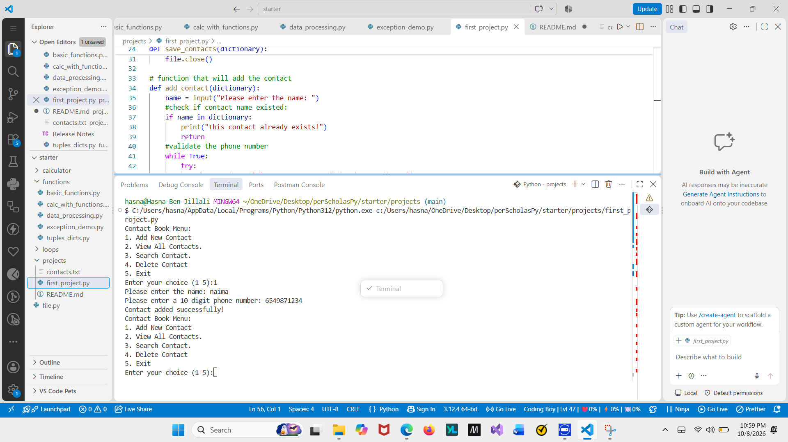
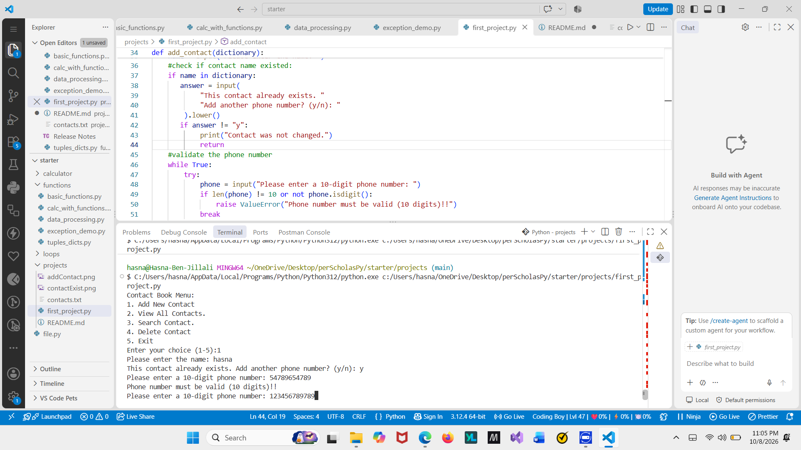
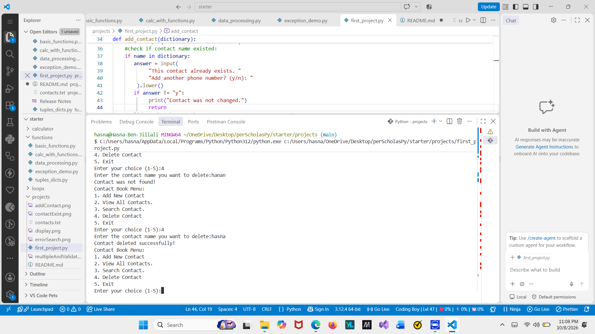
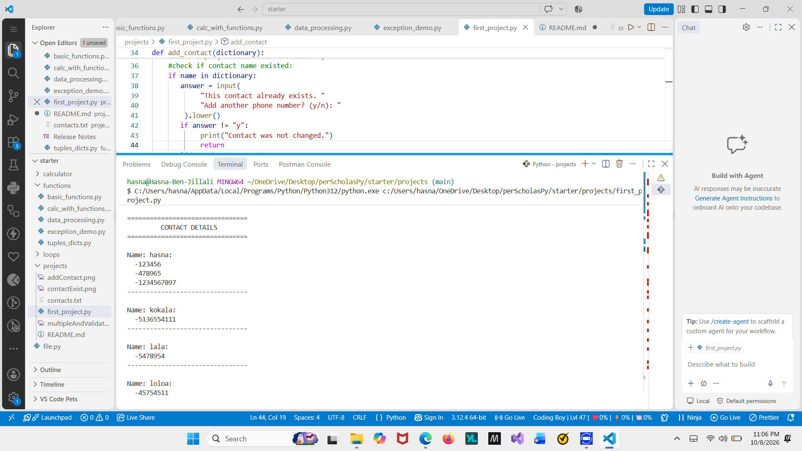
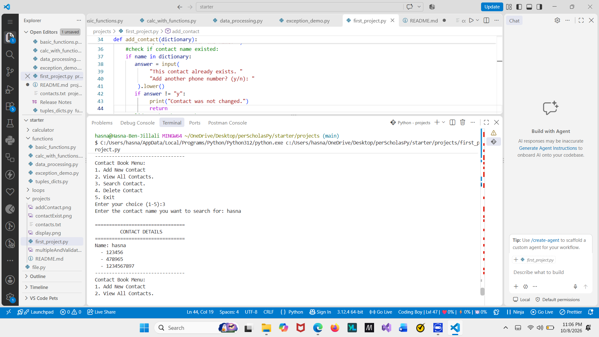

# Contact Book Application

## Project Overview

This Contact Book is a Python application developed for the Python Essentials 1 Skills-Based Assessment (SBA).
The program allows users to add, view, search, and delete contacts using a dictionary. It also uses file to save contacts in a text file so that they can be loaded when the program runs again.

## Features

### Add New Contact: 
   Add a contact with a name and a phone number.
### View All Contacts: 
   Display all saved contacts sorted.
### Search Contact: 
   Search for a contact by name and display their phone numbers.
### Delete Contact: 
   Remove a contact from the contact book.
### Input Validation: 
   Check phone numbers to make sure it is 10 digits using try/except.
### File Handling: 
   Save contacts to contacts.txt and load them when the program starts.
### Menu System: 
   Use a while loop to display the menu until the user presses 5 to exit.

## Technologies Used
Python
Dictionaries and lists
Functions
Loops and conditional statements
Exception handling (try/except)
File handling (open(), r,w)

## Program Structure and Challenges

I organized my Contact Book program into separate functions to add, display, search, and delete contacts. I also created functions to load contacts from a text file and save changes so the data is available when the program runs again.
I used a dictionary to store contact names and lists to support multiple phone numbers. The main program uses a  while loop to display the menu until the user chooses to exit.
One challenge I faced was figuring out how to store multiple phone numbers for the same person. I solved this by using a dictionary with a list of phone numbers for each contact.I also faced some challenges when working on loading data from files. I had to figure out how to separate the data using commas and handle line breaks correctly.

## Screenshots and Test Results

### Add New Contact:

### validate Contact:

### Delete A Contact:

### Display All Contacts:

### Search For A contact:

### Validate Search:

### Validate Phone Number:

